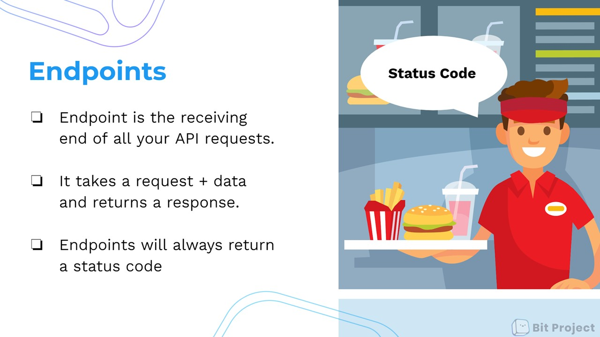
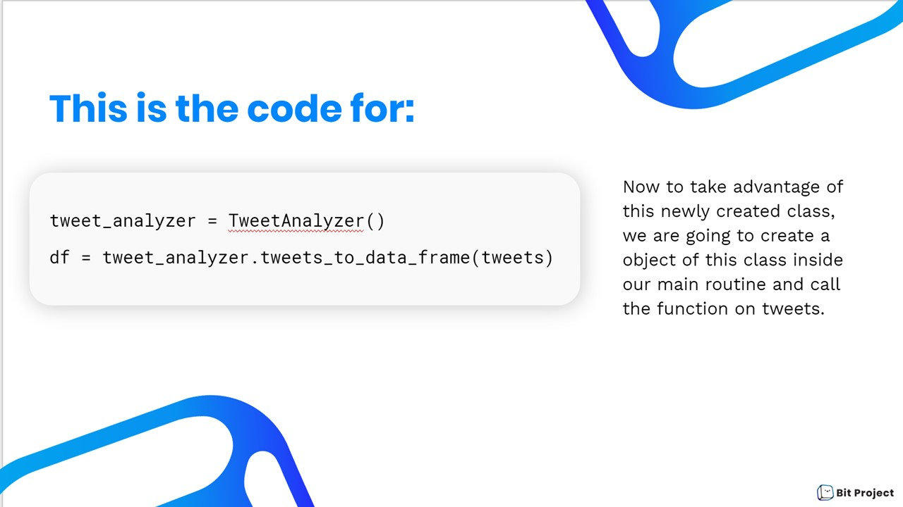

# Bit Project - Workshops
All of our workshop materials - open for everyone to use!

Our workshops are first written in Markdown, with one .md file corresponding to a slide. Each card must have the type of slide (please consult our Bit brand template) and appropriate labelings of content to be placed on the slide. 

# **Developing Markdown Cards --> PPT That Fits Inside Of Slide Template**

Here in Bit Project, we have already created curriculum cards for different activities and labs to help people learn about different data science topics. As we are also holding workshops so that people are actually learning these cards in a classroom and in person, we would like to make these cards into slides for presentation. 

Now that we have the existed activity cards, we would first convert them into simplified markdown cards that represent a slide. Then, with these simplified markdown files, we could make them into powerpoints easily.

Please follow the template below to convert activity cards into simplified markdown cards.

### Template For Representing Slides in Markdown Files

Each .md file should correspond to one slide, and the basic format to represent a slide in a markdown file is as shown below.

**Type:** _insert type here_

**Title:** _insert slide title here_

_insert slide content here_

---

_insert any explanations_ (will be in speaker notes)


We are specifying these details to help the design team when they put the information into the actual PPT.

### Specifying the Slide's Type

First, you need to specify the type -- what slide template you would like to use. Our design team has made many good BitProject slides templates, and you can find all of them [here](https://docs.google.com/presentation/d/1F5_Qcf_0IduoNKzRUT4owPlE5t5Ab8utmGHUMwZCM_g/edit#slide=id.p). You can make a copy of it and see the details of all templates by adding empty slides. 

### Title of the Slide

For almost all the templates, they have a block for title. So simply put the title of the slide after "**Title:**". You can use the corresponding title of the card, or be more specific.

### Organize the Content

Once you chose the template and finished the title, you should write the content of the slide. You need to specifically point out what content should be in which text/image box in the template. For example, there are 2 text boxes in the "small code snipet" template, so you need to specify what are in the upper text box, and what are in the lower text box. 


Since the slides are to help people visualize the ideas better and be like a summary, you should simplify and extract the content from the cards instead of copying it. There should not be long sentences or paragraphs on the slides. 

For example, when illustrating and explaining what the endpoint is in API, we put short sentences and place them after bullet points, and uses a visual and metaphor to help people understand the abstract concept. 




### Speaker's Notes

After that, you can use the cards or your own words to write the notes for the speaker to understand what they need to cover for the slide.

### More Tips

Often, one card contains too much information to be covered in one slide. So you should split them up and make sure the slides are reasonable and understandable.

At the same time, the slide should include as many visuals as it can (and we don't want to overwhelm the audience with paragraphs) to help illustrate ideas and keep the audience interested in the material.

### A Full Example of Representing A Slide in Markdown File 

Here is a full example of what a slide should be like in a markdown file.

**Type:** Code left/right

**Title:** *This is the code for:*

left text box

```python
tweet_analyzer = TweetAnalyzer()
df = tweet_analyzer.tweets_to_data_frame(tweets)
```

right text box

Now to take advantage of this newly created class, we are going to create a object of this class inside our main routine and call the function on tweets.

------

Speaker notes: 

Now to take advantage of this newly created class, we are going to create a object of this class inside our main routine and call the function on tweets.


And the corresponding actual slides would look like this:




# Code Review -Reviewing Markdown Cards

We also take existing workshops or tutorials and make them into activity cards to expand curriculum topics.

When converting the workshops into cards, we should make sure we meet the following requirements. The activity cards should have

- [ ] Significant interactive aspect (like the BitBloxs game in Postman workshop)
- [ ] Each card conveys significant ideas
- [ ] Each card has visuals
- [ ] The length of each card is reasonable
- [ ] Logical context progression from card to card
- [ ] Use full sentences instead of bullet points


### Significant Interactive Aspect

The cards should have significant interactive aspect. For example, the BitBloxs game is an interactive project in the Postman workshop. When converting these into cards, we would like to try to make every step very clear, like where to click, and include necessary screen shots to demonstrate the page, so that the students who are learning through reading the cards would know if they are on the good track.

### Each Card Conveys Significant Ideas

Each card should have a main idea to convey, instead of simply listing methods. For example, it may explain a concept such as "What is cURL" or "What does PUT requests do."

### Each Card Should Have some Sorts Of Visuals

The visuals can be something that help illustrate an abstract concept. For example, a drive-through animation to help illustrate the idea of API. The visuals can also be something that complement the description of a step, such as a screen shot to guide how to create an account. The visuals should be relevant to the text and help explain the text better. 

However, we don't need to include every single visuals in the slides because there would always be more than enough pictures to illustrate an idea and keep the audience engage in the workshop.

### The Length Of Each Card Should Be Reasonable

Each card should not be too long to read, or too short that fail to convey any idea. It should be considered wisely what slides can be put into one card and how to separate the contents.

For example, in the Postman workshop, it uses 3 slides to guide the student to "POST" in Postman. Since they are all about one big idea, we could put them together into one activity card.

### Logical Context Progression From Card to Card

The cards should be in an order that logically illustrate the activity. The background information and basic concepts should come at first. And it is better to have transition sentences to connect each cards so that people could know where they are. Sometimes it is necessary to reorder the slides to make the logic more smooth in cards. 

### Avoid Bullet Points and Use Full Sentences

Instead of bullet points in slides, the cards should be written in full sentences, and effectively convey the idea.