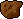

#### Adding Images

To start, let's customize the game with images.

We're providing the following images and have already uploaded them to an image
host, giving us a URL to load the images from in our code.

<br/>

> | **Player**                        |
> | --------------------------------- |
> |       |
> | `https://i.imgur.com/N5uCbDu.png` |

<br/>

> | **Enemy**                         |
> | --------------------------------- |
> |              |
> | `https://i.imgur.com/OdL0XPt.png` |

<br/>

> | **Background**                    |
> | --------------------------------- |
> |            |
> | `https://i.imgur.com/aKQOg3G.png` |

<br/>

Function from p5.js we need:

* [`loadImage()`](http://p5js.org/reference/#p5/loadImage) that takes URL of an
  image as an argument and gives us a loaded image ready to be used. p5.play
  sprites have the method
* [`addImage()`](http://p5play.molleindustria.org/docs/classes/Sprite.html#method-addImage)
  that we can give a loaded image to assign it to the sprite.
  `preload()`, which is run right when the page loads before `setup()`.
  * load images and other resources (like sounds)
    into the game

```js
// ...the rest of the variables
var enemy

function preload() {}

function setup() {
  // ...the rest of the setup function
}
```

