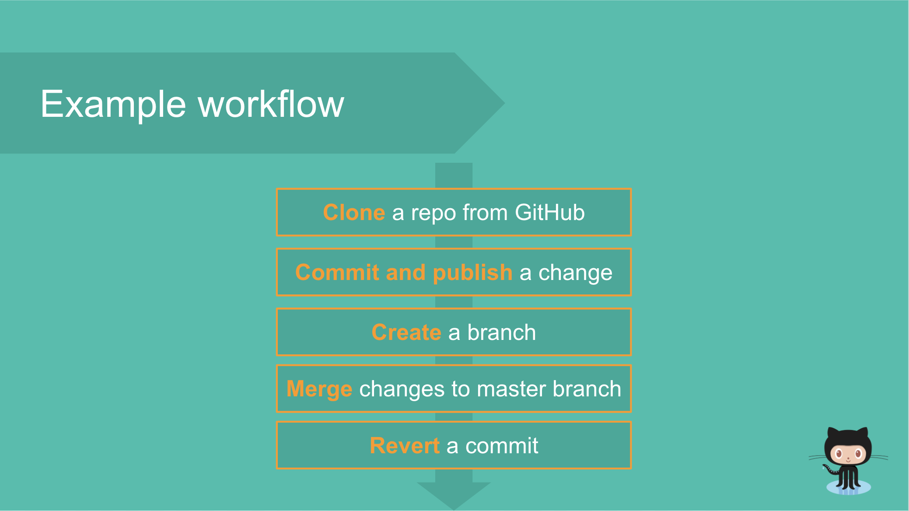

# How to Contribute to Workshops

## Basic Requirements for Integrating Any Workshop

For any workshop that you wish to contribute, ensure that it is sufficiently distinct from the workshops that Bit Project currently has. See <a href = "https://about.bitproject.org/teams/developer-relations/joining-as-an-organization#step-1-workshop-proposal">Workshop Proposal</a> for the complete list of the workshops Bit Project currently has.

Successful integration of any workshop involves the following main stages and sub-stages:

* **Placing your work in GitBook**
* **Stage 1: Preparation**
  * Step 1: Workshop Proposal
  * Step 2: Interactive Component Idea
  * Step 3: Responsibilities Delegated
* **Stage 2: Slides and Components**
  * Step 1: Presentation Slides Outline
  * Step 2: Completing Slides and Interactive Component
* **Stage 3: Presentation**
  * Step 1: Presentation Practice
  * Step 2: Present to Bit & Organization

For detailed information about each step and sub-step of the above workflow, see <a href = "https://about.bitproject.org/teams/developer-relations/joining-as-an-organization">Joining as an Organization</a>.

<h2 id = "Porting">Porting an Existing Workshop Into Our System

If you wish to contribute an existing workshop, ensure that all requirements outlined in <a href = "https://about.bitproject.org/teams/developer-relations/joining-as-an-organization">Joining as an Organization</a> have been met and make edits to your workshop as neccessary. 

maYou should be writing the content of each slide of your presentation in individual Markdown files; that is, each Markdown file corresponds to one slide of the presentation. Each Markdown file should (if applicable) contain the following information:

* Type of slide (i.e. title slide, centered text, link + code, code centered, etc.) 
* Title of slide
* Text of slide
* Images on slide
* Code on slide
* Speaker notes

For example, given the following slide (from a workshop that was not created by Bit Project):



The associate markdown card should look like:

<hr>

**Type of Slide**: centered text

Title: Example workflow

Text (Each bullet point is in its own text box. Behind these text boxes there is an arrow with tail at top and head at bottom):

- **Clone** a repo from GitHub
- **Commit and publish** a change
- **Create** a branch
- **Merge** changes to master branch
- **Revert** a commit

<hr>

In these Markdown files, it is essential that you not only provide the literal text that will go on the slide, but also add any additional notes about formatting, organization, etc. so that when the files are to be converted to slides, it is clear to **anyone** exactly how the slide should be formatted. For example, in the Markdown file, you should bold words that should be bolded on the slide and indicate if a certain text should be highlighted, underlined, etc. in the final product.

For details about placing your work in GitBook, see <a href = "https://about.bitproject.org/teams/developer-relations/joining-as-an-organization#placing-your-work-in-gitbook">Placing your work in GitBook</a>.

## Adding a Workshop in Collaboration with a Company

If you have a workshop in collaboration with a company that you would like to contribute, you should: 

* Reach out to developer advocates and set up 1-on-1 calls, in which you should
  * Introduce Bit Project as an organization and provide an overview of its goals.
  * Propose content collaboration. Make sure to show that you are passionate about what you do and highlight how you believe a collaboration with this **specific** company could be beneficial. Overall, be friendly, courteous, and respectful!
  * Give your contact information (email is the **most** important).

If the company agrees to a workshop collaboration, make sure to meet with them weekly in order to obtain their input on the work completed. Also, send frequent follow-up emails to ensure that you and the company are on the same page. Other than this, you should follow the same workflow outlined in <a href = "https://about.bitproject.org/teams/developer-relations/joining-as-an-organization">Joining as an Organization</a>. 

In terms of converting the content of the company's work into Markdown files, the requirements are the same as seen in <a href = "#Porting">Porting an Existing Workshop Into Our System</a>. However, when collaborating with a company, make sure to provide adequate credit to the company!

To integrate the work into our system, see <a href = "https://about.bitproject.org/teams/developer-relations/joining-as-an-organization#placing-your-work-in-gitbook">Placing your work in GitBook</a>. 

<h2 id = "Developing">Developing Workshops From Existing Activities/Labs

In order to convert our existing activities/labs into workshops, you should still follow the guidelines outlined in <a href = "https://about.bitproject.org/teams/developer-relations/joining-as-an-organization">Joining as an Organization</a>. The following are additional recommendations for how you can effectively convert an activity or lab into a workshop.

* Do NOT blindly copy/paste the information from the activity or lab to use in the presentation. This will often lead to an overwhelming amount of text on the screen. Instead, summarize the main points on the Markdown file corresponding to each slide and use speaker notes to fill in more detailed information that the presenter will explain to the audience

  * For example if an activity contains the following information, 

    ```
    Now, let’s look at the properties of queues:
    
    1. Queues are open from both ends meaning elements are added from the back and removed from the front
    2. The element to be added first is removed first (First In First Out - FIFO)
    3. If all the elements are removed, then the queue is empty and if you try to remove elements from an empty queue, a warning or an error message is thrown.
    4. If the queue is full and you add more elements to the queue, a warning or error message must be thrown.
    ```

    the associated markdown file should not contain everything! The text can be synthesized to

    ```
    Text:
    	* Insertion and Deletion happen on different ends.
        * Add elements to the rear
        * Delete elements from the front
      * Element to be added first is removed first (FIFO).
      * Remove element from empty queue? ERROR
      * Add element to full queue? ERROR
    --------------------------------------------------------------------------------------
    Speaker notes: 
    * Explain that adding elements to the rear and deleting elements from the front means that the queue is “open” from both ends
    ```

* Use plenty of images that presenters can use to explain concepts, helping minimize word count on each respective Markdown file/slide. These images do not necessarily need to be a part of the activity or lab themselves, but they should be related to the content on the slide.

* Integrate code snippets as neccessary.

* Try not to have more than one card from an activity/lab represented on a single Markdown file (which corresponds with a slide). If you find yourself doing this, it probably means that you are including too much text or not adequately presenting each card. 

See the workshops README for detailed information about how to develop Markdown cards from existing activities/labs.

## Converting Medium Tutorial Articles to Markdown Files

The general guidelines for taking existing Medium tutorial articles and converting them to Markdown files for a Bit Project workshop is the same as outlined in <a href = "#Developing">Developing Workshops From Existing Activities/Labs</a> and is futher detailed in the workshops README. 

The most important requirement is to give adequate credit (make sure to **cite** them by last name) to the author of the article! However, the following are further points that specifically pertain to converting Medium tutorial articles to Markdown files. We will be using <a href = "https://medium.com/free-code-camp/how-to-create-an-expense-organizer-with-javascript-in-10-minutes-d6dd3541ab5e">this</a> article as an example.

* Before beginning the writing process, read through and follow the article as if you were the student. This will help you in specifying anything that is unclear in the article when you begin to write your Markdown files.

* Many articles begin with an introduction about the topic being discussed. While you should have Markdown files for the introduction, you should limit them to only the most important aspects. For example, the author of the article introduces the piece as follows.

  ```
  "In this article, I’ll show you how to create a handy little app which keeps track of your receipts. It allows you to dump all your receipts into a Dropbox folder and then hit a button to organize them by month.
  
  This is especially useful for when you’re doing accounting, as you normally want to do it on a month-by-month basis. Having all your receipts from a given month grouped together in a single folder can help you save a lot of time.
  
  In this tutorial we’ll cover:
  * Creation of a Dropbox account and setting up our project development environment
  * UI creation with Vanilla JavaScript — including fetching data, rendering elements, basic state management, and simple navigation.
  * Some Dropbox API methods for getting and moving files." (Borgen)
  ```

  In a Markdown file, you should succinctly summarize this as follows.

  ```
  Title: Introduction
  Text:
  	* Let's create an app to handle and organize receipts!
    * Learning goals
    	* "UI creation with Vanilla JavaScript"(Borgen)
    	* "Dropbox API methods" (Borgen)
  
  Note at bottom of slide: Information and code credit to Per Harald Borgen.
  --------------------------------------------------------------------------------------
  Speaker notes: 
  * Explain the uses for the app
  * Mention that the workshop will teach the "[c]reation of a Dropbox account and setting up [the] project development environment" (Borgen)
  * Explain that audience will understand "UI creation with Vanilla JavaScript — including fetching data, rendering elements, basic state management, and simple navigation." (Borgen)
  * Mention specifically that "Dropbox API methods [will be] for getting and moving files." (Borgen)
  ```

  Notice how the Markdown file cites the author of the article by last name (Borgen) when needed. Furthemore, notice the speaker notes have much more text than the actual text section!

* The Medium articles may already be broken down into steps for you. For example, in our example article, the author has already separated the information into subsections. Use this to your advantage to help moduralize your Markdown files so that the information flows in a natural manner. For each subsection, do the following:

  * Only write the high level ideas for each subsection and leave detailed explanation for the speaker notes. Have the subsections span multiple markdown files if there is  a lot of information.
  * Use plenty of images as these articles often have screenshots of code and examples that make the information presented easier to follow. Don't be afraid to have only an image on a particular Markdown file (with adequate speaker notes, of course).
  * If the article gives the final code of the project they are presenting, make sure to have a Markdown file at the end which links to it!

Here is another example of how information from our example Medium article can be used for our workshop.

The author writes:

```
"Fetching data

To display data in our app we need to fetch it first. Let’s get the receipts we have in our Dropbox folder.

We can use filesListFolder() method. It accepts a folder and returns a promise, which when resolved gives us the contents of the folder. There is a little gotcha with this method, because to specify a root path (the base folder that we’re in) we need to specify an empty string '' and not '/'.

dbx.filesListFolder({
  path: ''
}).then(res => console.log(res)) " (Borgen)

```

This can be converted to

```
Title: Fetching Data - Getting Receipts
Text:
	* Need to "get...receipts" (Borgen)
	* "`filesListFolder()`" (Borgen)
		* CAUTION: "root path" (Borgen)
Code:
	dbx.filesListFolder({
  path: ''
}).then(res => console.log(res)) " (Borgen)

Note at bottom of slide: Information and code credit to Per Harald Borgen.	
--------------------------------------------------------------------------------------
Speaker notes: 
* Explain that "filesListFolder() method...accepts a folder and returns a promise, which when resolved gives us the contents of the folder." (Borgen)
* Explain that "to specify a root path...we need to specify an empty string '' and not '/'"
```

Notice how we title the Markdown file with the specific part of the "Fetching Data" (Borgen) section that we are focusing on from the article. That is, we recognize that this is just the first part of "Fetching Data" (Borgen), but dedicate an entire Markdown file to it.

For details about placing your work in GitBook, see <a href = "https://about.bitproject.org/teams/developer-relations/joining-as-an-organization#placing-your-work-in-gitbook">Placing your work in GitBook</a>.

## School Onboarding

One of the main goals of Bit Project is to expand by having other schools join and actively participate in developing curriculum. Such holds for contributing to workshops as well.

Schools that are interested in integrating their workshops or helping in developing workshops should see <a href = "https://about.bitproject.org/teams/developer-relations/joining-as-an-organization">Joining as an Organization</a> for detailed information on how they can do so. 
