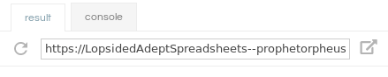

_type: Center img outline_

_title: Previewing the Page_
#  Previewing the Page
- The URL above the website preview is the live URL for your website

---
[for speaker]<> From there, the live preview to the right of the editor should show what your website looks like. If you want to view it in a new tab, the URL above the website preview is the live URL for your website