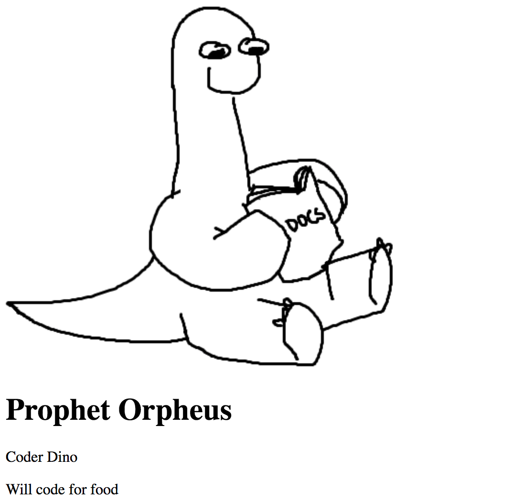

_type: Center img outline_

_title: Previewing the Page_
# Previewing the Page

### Remember, you need to **Run** your program every time you want to see your updated website.

---
[for speaker]<> 
Though our website has some text on it and exists on the _internet_, we're not done. Our webpage is fully functional, but needs a little help in the look-and-feel department. Fret not. CSS will allow you to manipulate the styling of your page in all your needs.
