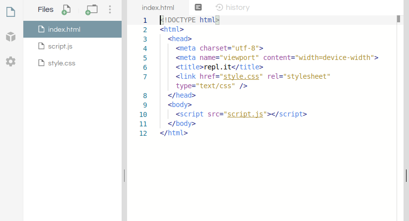

_type: text + img_

_title: Part II: The HTML File_
# Part II: The HTML File
HTML stands for Hypertext Markup Language. Every website from the New York Times to Twitch uses HTML to display content on the web.

---
[for speaker]<> You should have the `index.html` file open, and a bunch of text with `<` & `>` symbols. That's HTML!