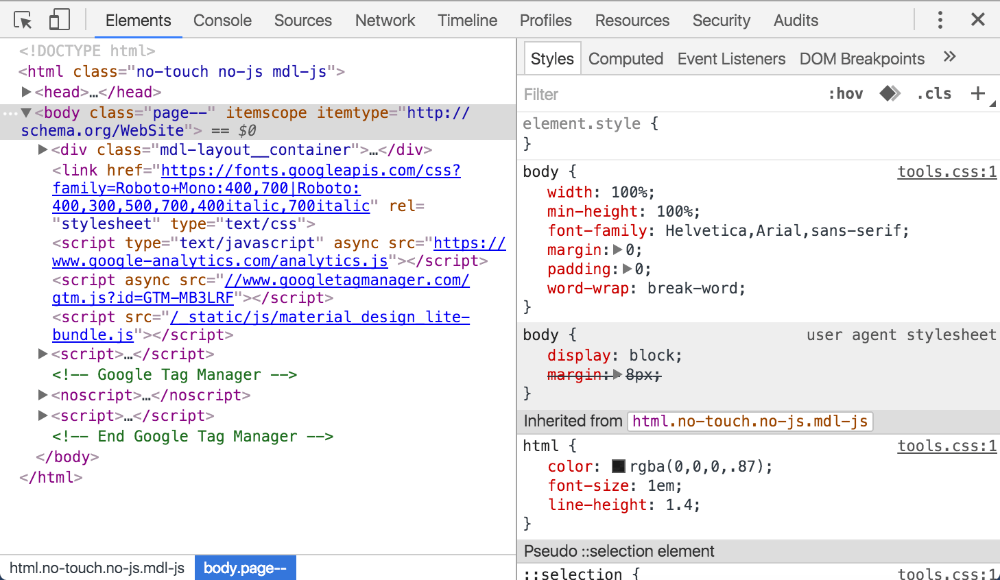

_type: text + img_

_title: HTML Structure_
# HTML Structure
- Right click on any web page, 
- Click "View page source" (or "Inspect" )

<!-- Source https://developers.google.com/web/tools/chrome-devtools/inspect-styles/imgs/elements-panel.png -->

---
[for speaker]<> This structure is common to all HTML pages. In fact, you can take a look for yourself! Just right click on any web page,and click "View page source" (sometimes called "Inspect" depending on your browser) to see what's going on behind the scenes. You'll find each of these elements on every page – the doctype, and an HTML tag wrapped around a head and body.