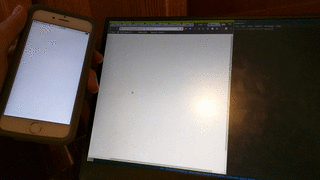

# Sketch Together

| What you'll be building |
| ----------------------- |
|  |

_We recommend going through this workshop in Google Chrome._

Links to a live demo and the final code below. This workshop should take around 1 hour.

[**Live Demo**](https://collaborative-sketch--prophetorpheus.repl.co)

[**Final Code**](https://repl.it/@prophetorpheus/collaborative-sketch) 

Draw with one or more friends! In this project we'll be combining HTML, p5.js, Firebase, and jQuery to create a collaborative sketchpad. We'll use p5.js to manipulate the drawing space, Firebase to keep track of our drawing in terms of points that we've marked in our drawing, and jQuery to easily manipulate HTML elements.