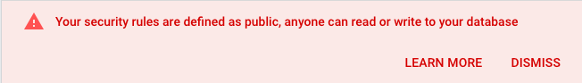

After we're going to select `Rules`. Here we'll set database permissions for reading and writing to `true`.

```json
{
  "rules": {
    ".read": true,
    ".write": true
  }
}
```

Click `Publish` to save your changes. You should see this warning at the top of your page -- don't worry about it:

